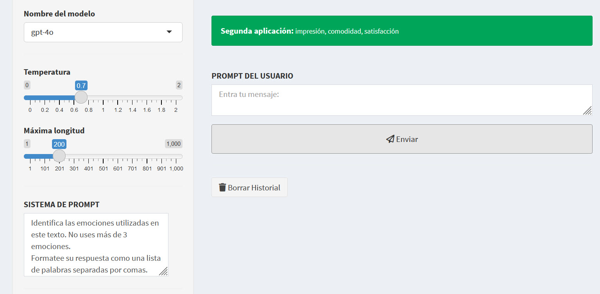
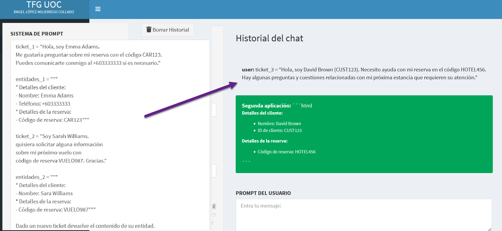

# Análisis de Texto

## Introducción al Análisis de Texto

Es hora de analizar texto utilizando prompts efectivos. El análisis de texto es el proceso de examinar texto para extraer información relevante de él. Exploraremos técnicas de clasificación de texto y extracción de entidades, aplicándolas a datos de muestra de clientes. Nótese que los ejemplos utilizados aquí son completamente ficticios, y las empresas siempre deben buscar asesoramiento legal para comprender cuándo y cómo usar los datos de los clientes en cumplimiento con las regulaciones y leyes de privacidad.

## Clasificación de Texto

Comencemos con la clasificación de texto, donde el objetivo es asignar una de varias categorías potenciales a un texto específico. Una ilustración bien conocida de la clasificación de texto es el análisis de sentimientos, donde el objetivo es asignar un sentimiento como positivo, negativo o neutral a un texto proporcionado. Para clasificar textos de manera efectiva, debemos especificar las categorías de clasificación en el prompt cuando se conocen, junto con los requisitos de salida que buscamos. Por ejemplo, al pedir al modelo que clasifique el sentimiento de una reseña de reloj inteligente, mencionamos explícitamente las opciones como positivo, negativo o neutral y pedimos una respuesta de una sola palabra. El modelo responde según nuestras especificaciones. Ver Figura \@ref(fig:CURSO-53).

(\#fig:CURSO-53)Clasificar un texto como positivo, negativo o neutral.

## Análisis de Sentimientos sin Categorías Definidas

Cuando no se especifican las categorías de clasificación, el modelo se basa en su conocimiento interno para realizar la clasificación. Supongamos que usamos el prompt del ejemplo anterior sin definir categorías. En ese caso, la salida será la misma ya que estamos buscando las salidas clásicas del análisis de sentimientos que el modelo ya conoce. Sin embargo, este enfoque no es probable que produzca resultados esperados en ejemplos más complejos. Por esta razón, es mejor práctica proporcionar clases específicas cuando sea posible.

## Clasificación de Textos con Múltiples Clases

A veces los textos pueden encajar en múltiples clases. Por ejemplo, una reseña podría expresar múltiples emociones. Dado que las emociones pueden ser diversas, es posible que no tengamos una lista completa predefinida. Podemos pedir al modelo que reconozca emociones sin proporcionarlas. Definir un número máximo de clases para listar para un texto dado es una mejor práctica en estas situaciones. Para la reseña del reloj inteligente, instruimos al modelo para que identifique un máximo de tres emociones separadas por comas. El modelo encuentra que el cliente estaba impresionado, cómodo y satisfecho (Figura \@ref(fig:CURSO-54)).

(\#fig:CURSO-54). Clasificar un texto con tres emociones.

## Extracción de Entidades

Otra forma de analizar texto es mediante la extracción de entidades, donde el objetivo es extraer entidades específicas de un texto dado, incluyendo nombres, lugares, organizaciones y fechas. Para extraer las entidades de manera efectiva, debemos especificar las entidades a extraer y el formato de salida deseado. En este ejemplo, tenemos una descripción de producto para un teléfono móvil y pedimos al modelo que identifique el nombre del producto, el tamaño de la pantalla y la resolución de la cámara mientras formatea la respuesta como una lista desordenada. 

(\#fig:CURSO-55)Ejemplo de extracción de entidades.

Vemos en la Figura \@ref(fig:CURSO-55) cómo el modelo extrae el nombre del producto, el tamaño de la pantalla y la resolución de la cámara, formateándolos como se solicitó.

## Prompting de Pocos Disparos para Extracción de Entidades

Cuando las entidades y su estructura son demasiado complejas para explicarlas al modelo, podemos usar un prompt de pocos disparos. Supongamos que tenemos dos ejemplos de tickets de soporte de 2 clientes que usan una aplicación de reserva de viajes y sus entidades extraídas. Observamos que las entidades poseen una estructura compleja donde las entidades principales como detalles del cliente y de la reserva son comunes para ambos tickets. Pero cada uno de ellos está representado además por subentidades que varían dependiendo de la información encontrada en el ticket correspondiente. Por ejemplo, la entidad uno tiene teléfono, pero la entidad dos no. Supongamos que tenemos este nuevo ticket, ticket tres de un cliente llamado David y queremos extraer sus entidades de la misma manera que los dos tickets anteriores. Formulamos un prompt de pocos disparos que contiene los ejemplos de tickets, sus entidades extraídas y el nuevo ticket. El modelo en la Figura \@ref(fig:CURSO-56) extrae las entidades del ticket tres siguiendo una estructura similar a los ejemplos proporcionados y capturando nuevas subentidades como el ID del cliente.

(\#fig:CURSO-56)Ejemplo de extracción de entidades con pocos disparos.

<h3 style="font-weight: bold; text-align: center;">Video Tutorial: Análisis de Texto</h3>
  <iframe width="500" height="400" src="https://www.youtube-nocookie.com/embed/ciVf6viBtRQ?rel=0" frameborder="0" allow="accelerometer; autoplay; encrypted-media; gyroscope; picture-in-picture" allowfullscreen></iframe>

