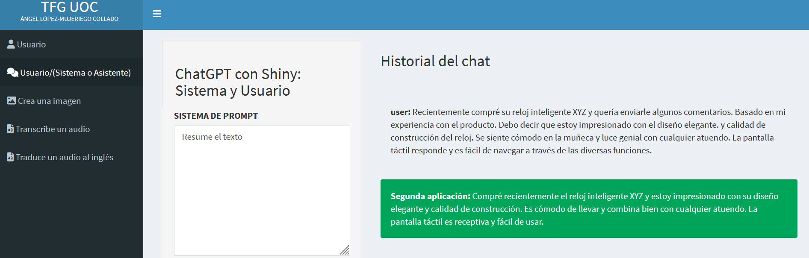
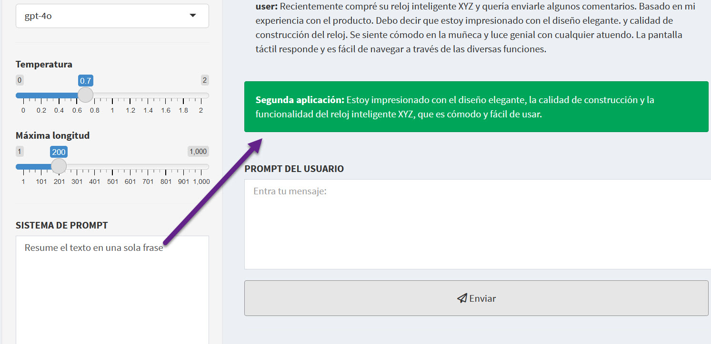
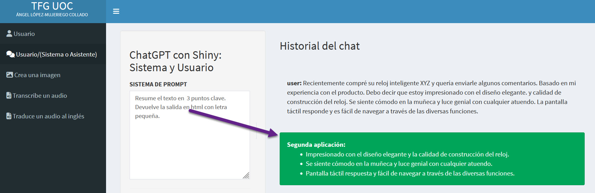
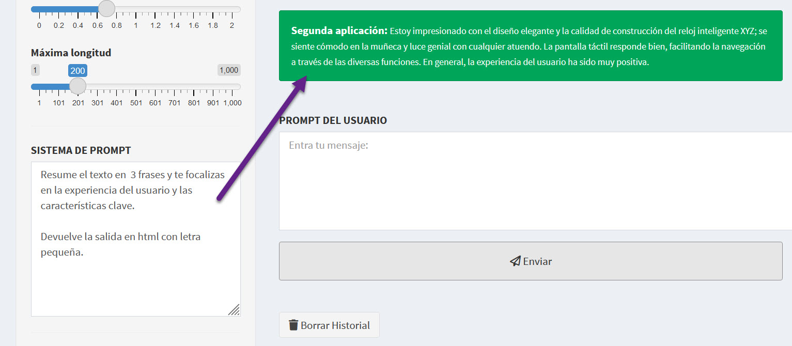
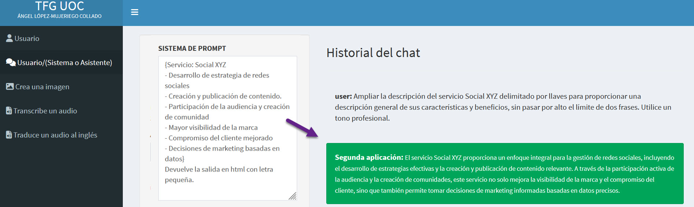

# Aplicaciones Comerciales de la Ingeniería de Prompts

## Resumido y Expansión de Texto

Ahora que estamos cómodos con los principios y estrategias de la ingeniería de prompts, es hora de poner este conocimiento en práctica para diversas aplicaciones comerciales. Nos enfocaremos ahora en desarrollar prompts efectivos para el resumen y expansión de texto. El resumen de texto consiste en condensar un texto en una versión más corta, coherente e informativa mientras se preserva su significado esencial. Esta poderosa técnica agiliza los procesos comerciales en diversas industrias. En finanzas, por ejemplo, acelera la toma de decisiones al resumir informes extensos. En marketing, ayuda a transformar los comentarios de los clientes en información procesable, lo que permite estrategias de campaña más efectivas. Podemos aprovechar los modelos de lenguaje para resumir un texto dado, pero debemos aprender cómo hacerlo de manera efectiva. A primera vista, resumir texto consiste solo en proporcionar texto al modelo y pedirle que lo resuma. Aquí tenemos un texto que representa una reseña de un reloj inteligente sobre el diseño, la calidad y la comodidad del producto. Pedimos al modelo que lo resuma usando un prompt delimitado y sin otras instrucciones. Aunque el modelo resumirá el texto proporcionado, el prompt podría ser más efectivo ya que no especifica detalles para guiar el comportamiento del modelo mientras resume. Podemos especificar los límites de la salida, la estructura de la salida y el enfoque del resumen para hacer el prompt más efectivo. El resultado sin más especificaciones se ve en la Figura \@ref(fig:CURSO-40).

(\#fig:CURSO-40)Resumen de un texto.

## Límites de Salida en la Resumido de Texto

Implementemos cada uno de estos. Podemos especificar los límites de la salida por el número de oraciones, palabras o caracteres. Aquí, para la misma reseña del reloj inteligente, modificamos el prompt para resumirlo en una oración, lo cual vemos reflejado en la salida en la Figura \@ref(fig:CURSO-41).

(\#fig:CURSO-41)Resumen de un texto especificando que sea en una sola frase.

## Estructura de Salida en la Resumido de Texto

También podemos especificar la estructura de la salida mencionando explícitamente el formato deseado en el prompt. Por ejemplo, aquí pedimos al modelo que resuma la reseña del reloj inteligente en un máximo de tres puntos clave. Ahora la salida es un resumen de tres viñetas que refleja las cualidades del reloj como se puede ver en la Figura \@ref(fig:CURSO-42).

(\#fig:CURSO-42)Resumen de un texto especificando que sea 3 puntos clave.

## Enfoque en Aspectos Específicos

Finalmente, podemos pedir al modelo que se enfoque en aspectos específicos de la reseña del producto mientras resume. Aquí, por ejemplo, instruimos al modelo que resuma la reseña en tres oraciones, enfocándose en las características clave y la experiencia del usuario. Esto nos ayuda a comprender rápidamente las fortalezas y debilidades del producto. 

(\#fig:CURSO-43)Resumen de un texto especificando que sea 3 frases, características clave y experiencia de usuario.

Como podemos ver en la Figura \@ref(fig:CURSO-43), la respuesta tiene precisamente 3 oraciones destacando los comentarios positivos del usuario y las características clave que disfrutaron del producto.

## Expansión de Texto

Lo opuesto a la resumido de texto es la expansión de texto, que tiene como objetivo generar texto basado en algunas ideas o puntos clave. La expansión de texto es altamente relevante para las empresas. Puede mejorar significativamente la eficiencia y productividad al agilizar la comunicación y reducir el tiempo dedicado a tareas repetitivas como redactar correos electrónicos estandarizados o generar grandes volúmenes de texto para informes o documentación. Con LLMs, podemos expandir efectivamente el texto utilizando prompts bien elaborados. Un prompt típico de expansión de texto debe decirle al modelo que expanda un texto delimitado destacando los aspectos necesarios en los que centrarse mientras proporciona los requisitos de salida, incluyendo tono, longitud, estructura y audiencia. Ilustremos esta expansión con un ejemplo. 

(\#fig:CURSO-44)Expansión de un texto dando indicaciones de cómo hacerlo.

Supongamos que tenemos la descripción de la Figura  \@ref(fig:CURSO-44) con puntos clave para un servicio relacionado con las redes sociales. Los puntos clave enumeran los servicios de la compañía, como creación de contenido y construcción de comunidad. Queremos crear un texto coherente para presentarlo efectivamente. Para hacerlo, pedimos al modelo que expanda la descripción del servicio para proporcionar una visión general de sus características y beneficios. Usando un prompt delimitado, y especificamos todos los requisitos de salida necesarios, incluyendo un límite de salida de dos oraciones como máximo y el tono profesional. El modelo expande la descripción del servicio en dos oraciones usando un tono profesional.

<h3 style="font-weight: bold; text-align: center;">Video Tutorial: Aplicaciones Comerciales de la Ingeniería de Prompts</h3>
  <iframe width="500" height="400" src="https://www.youtube-nocookie.com/embed/EM-m0MuYEYM?rel=0" frameborder="0" allow="accelerometer; autoplay; encrypted-media; gyroscope; picture-in-picture" allowfullscreen></iframe>

