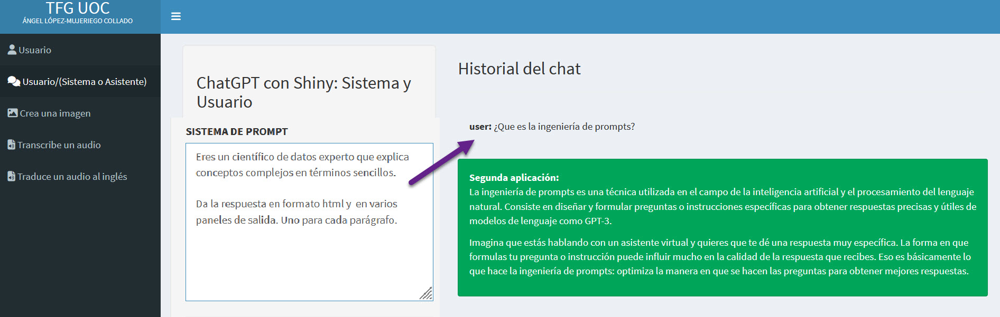
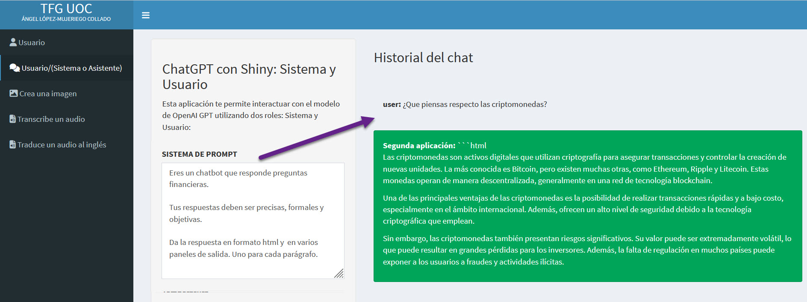
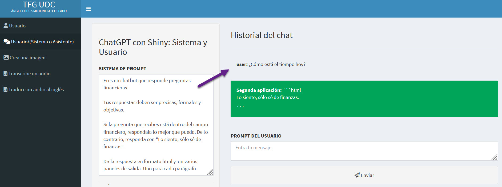

# Desarrollo de Chatbots

## Importancia de la Ingeniería de Prompts en Chatbots

Exploremos la ingeniería de prompts para el desarrollo de chatbots. Hasta ahora, hemos visto cómo los prompts efectivos ayudan a los usuarios a optimizar su uso de un modelo de lenguaje. Pero ¿por qué la ingeniería de prompts es vital en el desarrollo de chatbots? Como desarrollador, predecir las preguntas de los usuarios es difícil al crear un chatbot. Podemos poseer datos valiosos sobre búsquedas en el sitio e investigaciones, pero el desafío radica en garantizar respuestas efectivas para cualquier consulta. Aquí es donde la ingeniería de prompts puede guiar el comportamiento del chatbot en la respuesta a preguntas, asegurando tanto fiabilidad como efectividad.

## Uso de la API de OpenAI en Chatbots

¿Cómo logramos esto usando la API de OpenAI? Recordemos que cada mensaje que enviamos tiene un rol designado (Usuario, Sistema, Asistente). Nos enfocaremos en los mensajes de sistema para construir un chatbot, ya que estos guían el comportamiento del modelo al responder a los usuarios. Como recordatorio, el punto de acceso de finalización del chat es adecuado para el desarrollo de chatbots. A través de este punto de acceso, enviamos una serie de mensajes al modelo en formato de lista, cada uno asignado a un rol particular. En este ejemplo, enviamos un mensaje de sistema que dirige al chatbot a actuar como un experto científico de datos, simplificando ideas complejas, seguido de un mensaje de usuario que busca una explicación de la ingeniería de prompts tal y como se ve en la Figura \@ref(fig:CURSO-61). 

(\#fig:CURSO-61)Usar tanto el rol del usuario como el rol del sistema.

<h3 style="font-weight: bold; text-align: center;">Video Tutorial: Uso de la API de OpenAI en Chatbots</h3>
  <iframe width="500" height="400" src="https://www.youtube-nocookie.com/embed/RuxFFzlG5zA?rel=0" frameborder="0" allow="accelerometer; autoplay; encrypted-media; gyroscope; picture-in-picture" allowfullscreen></iframe>

## Directrices de Respuesta para Chatbots

Debemos incorporar directrices claras de respuesta para dirigir el comportamiento del modelo, incluyendo la audiencia objetivo, el tono esperado, la longitud de la salida y la estructura de la salida. No necesitaremos definir todo, pero debemos ser específicos sobre lo que se adapte a nuestro caso de uso. En el ejemplo de un chatbot financiero, podemos pedirle al modelo a través del prompt del sistema que responda de manera precisa, formal y objetiva. Supongamos que el usuario pregunta la opinión del chatbot sobre las criptomonedas a través de un prompt de usuario. Vemos cómo el chatbot responde con precisión, comenzando con la definición de criptomonedas y luego detallando sus ventajas y desventajas para mantenerse objetivo según nuestra solicitud. Y finalmente, proporciona un resumen. Ver Figura \@ref(fig:CURSO-62).

(\#fig:CURSO-62)Usar tanto el rol del usuario como el rol del sistema dándole más información de comportamiento.

<h3 style="font-weight: bold; text-align: center;">Video Tutorial: Directrices de Respuesta para Chatbots 1</h3>
  <iframe width="500" height="400" src="https://www.youtube-nocookie.com/embed/kVEHf7AHgGQ?rel=0" frameborder="0" allow="accelerometer; autoplay; encrypted-media; gyroscope; picture-in-picture" allowfullscreen></iframe>

También queremos considerar la guía de comportamiento. Podemos usar prompts condicionales para decirle al modelo cómo responder a las preguntas de los usuarios. Por ejemplo, podríamos no querer que el chatbot financiero responda a consultas no relacionadas con las finanzas. Para hacerlo, le decimos al modelo en el prompt del sistema que responda a preguntas financieras lo mejor posible y para otras preguntas, la respuesta debe ser “Lo siento, solo sé sobre finanzas”. 

(\#fig:CURSO-63)Usar tanto el rol del usuario como el rol del sistema dándole más información de comportamiento en formato condicional.

En consecuencia, si un usuario pregunta sobre el clima, el chatbot aclarará que su único dominio es finanzas tal y como se ve en la Figura \@ref(fig:CURSO-63).

<h3 style="font-weight: bold; text-align: center;">Video Tutorial: Directrices de Respuesta para Chatbots 2</h3>
  <iframe width="500" height="400" src="https://www.youtube-nocookie.com/embed/99pZ5tndpX8?rel=0" frameborder="0" allow="accelerometer; autoplay; encrypted-media; gyroscope; picture-in-picture" allowfullscreen></iframe>

