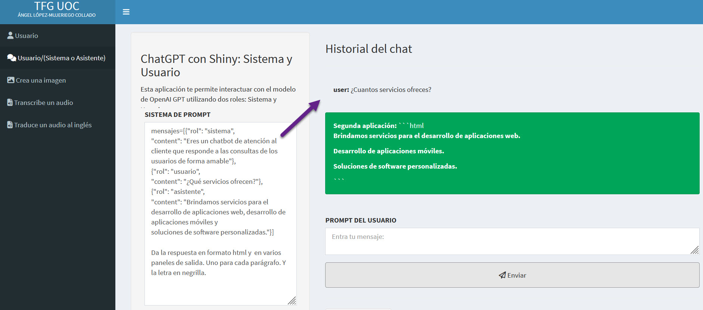
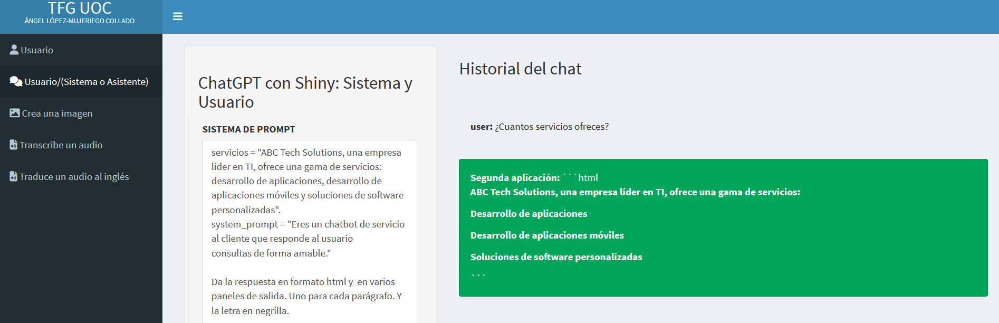

# Incorporación de Contexto Externo en Chatbots

## Introducción a la Incorporación de Contexto Externo

Una consideración clave al crear un chatbot es incorporar algún contexto externo. Veamos por qué es importante y cómo podemos lograrlo. Usamos un modelo de lenguaje preentrenado al construir un chatbot usando la API de OpenAI. Tales modelos solo reconocen información específica en la que han sido entrenados. Sin embargo, podríamos querer que nuestro chatbot sepa más que eso. Debemos proporcionarle algún contexto sobre la información faltante para asegurar que responda con precisión y efectividad a las preguntas de los usuarios.

## Limitaciones de Conocimiento de los LLMs

Pero ¿por qué los LLM parecen tener dificultades para tener alguna información? Hay dos razones principales. Primero, los modelos de lenguaje han sido entrenados en grandes cantidades de datos de la web. Por lo tanto, cuando les preguntamos sobre un concepto que ocurrió después de que el modelo fue entrenado, o después de lo que llamamos el corte de conocimiento, tendrán dificultades para responder o inventarán una respuesta. Por ejemplo, si preguntamos a un modelo de lenguaje lanzado en 2021 sobre las tendencias financieras prominentes de 2023, su respuesta podría ser: “Lo siento, pero hasta mi última actualización de conocimiento en 2021, no tengo información sobre las tendencias financieras en 2023”. Puede que hayamos encontrado mensajes similares de ChatGPT al buscar información actualizada. Segundo, la información que estamos preguntando al modelo podría no estar disponible públicamente, lo que significa que está fuera del alcance de su entrenamiento. En ese caso, no se podría esperar que el modelo sepa la respuesta.

## Provisión de Contexto Externo

Supongamos que pedimos al chatbot a través de un prompt del sistema que actúe como un compañero de estudio. Luego preguntamos a través de un prompt de usuario sobre el nombre del instructor favorito. Esta es una pregunta personal que el modelo no sabría. Necesitamos proporcionar información adicional al modelo como contexto para que el chatbot la use al responder a las preguntas de los usuarios. El contexto puede darse como una muestra de conversaciones previas o a través del prompt inicial del sistema. Podemos proporcionar conversaciones de muestra que guíen al modelo sobre cómo debe responder a preguntas específicas. Por ejemplo, comenzamos diciendo al modelo a través de un mensaje del sistema que es un chatbot de servicio al cliente. Le proporcionamos un prompt de ejemplo donde el usuario pregunta sobre los servicios que ofrece la empresa. Luego proporcionamos una respuesta del asistente que incluye los servicios proporcionados. Finalmente, el modelo reconocerá esta información del contexto cuando preguntemos cuántos servicios se ofrecen. (Figura \@ref(fig:CURSO-66)).

(\#fig:CURSO-66)Ejemplo de incorporación de contexto externo.

<h3 style="font-weight: bold; text-align: center;">Video Tutorial: Provisión de Contexto Externo</h3>
  <iframe width="500" height="400" src="https://www.youtube-nocookie.com/embed/cCl77tFfn60?rel=0" frameborder="0" allow="accelerometer; autoplay; encrypted-media; gyroscope; picture-in-picture" allowfullscreen></iframe>

## Limitaciones del Contexto de Muestra

Una desventaja de este método es que podría requerir muchas preguntas y respuestas de muestra. Una forma más efectiva de hacer esto es proporcionar el contexto dentro del prompt del sistema. Supongamos que una empresa llamada ABC Tech Solutions quiere que el modelo conozca sus servicios. La empresa debe definirlos inicialmente dentro de la variable de cadena. Luego, el prompt del sistema incluirá los servicios y las partes clásicas del prompt del sistema que hemos aprendido, incluyendo el propósito del chatbot y las pautas de comportamiento. Cuando un usuario pregunta sobre el número de servicios que ofrece la empresa, el modelo responderá con los tres servicios del prompt del sistema: desarrollo de aplicaciones web, desarrollo de aplicaciones móviles, y soluciones de software personalizadas. Una cosa a tener en cuenta es que estos métodos funcionarán bien para contextos relativamente pequeños porque cualquier LLM tendrá algunas limitaciones en la cantidad de contexto que puede manejar. Cuando se necesita una gran cantidad de contexto, deben aplicarse técnicas más sofisticadas que están fuera del alcance de este curso. (Figura \@ref(fig:CURSO-67)).

(\#fig:CURSO-67)Ejemplo de incorporación de contexto externo de muestra.

<h3 style="font-weight: bold; text-align: center;">Video Tutorial: Limitaciones del Contexto de Muestra</h3>
  <iframe width="500" height="400" src="https://www.youtube-nocookie.com/embed/CCsxJgs6ky8?rel=0" frameborder="0" allow="accelerometer; autoplay; encrypted-media; gyroscope; picture-in-picture" allowfullscreen></iframe>

