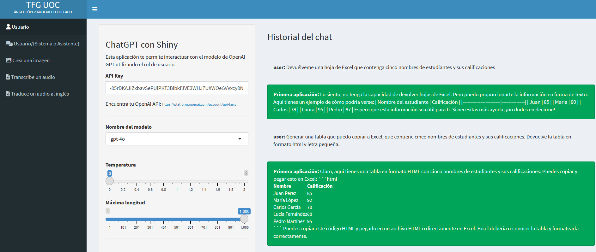

# Prompting de Autocoherencia e Ingeniería de Prompts Iterativa

## Introducción al Prompting de Auto coherencia

Aquí es donde entran los prompts de auto coherencia. El prompting de auto coherencia es una técnica que genera múltiples cadenas de pensamientos al solicitar al modelo varias veces para obtener diferentes salidas. La salida final se obtiene mediante una votación por mayoría, donde la salida o respuesta más comúnmente ocurrida entre las salidas individuales se selecciona como el resultado final.

## Ejemplo de Uso del Prompting de Autocoherencia

Aunque podemos implementar esta técnica solicitando manualmente al modelo varias veces y comparando los resultados, discutamos un prompt que podemos usar en su lugar. Definimos una instrucción de auto coherencia donde pedimos al modelo que imagine que varios expertos independientes están respondiendo una pregunta y la respuesta final se obtiene por mayoría de votos. Para resolver este tipo de prompts vamos a usar la aplicación 2, tal y como se ve en la Ver Figura \@ref(fig:CURSO-37). tiene dos entradas, la del usuario, que es la que hemos venido utilizando hasta ahora y luego tiene otra entrada llamada SISTEMA DE PROMPT que puede hacer el rol de Sistema o de Asistente. 

(\#fig:CURSO-37)Aplicación 2: Usuario/(Sistema o Asistente).

Este prompt debe especificar explícitamente el número de expertos involucrados, en este caso 3. Luego definimos la pregunta y el problema a resolver, un problema matemático donde necesitamos determinar el número de autos en un estacionamiento. Creamos el prompt final combinando la instrucción de auto coherencia y el problema a resolver. En la salida, el modelo da la respuesta de cada experto y agrega el resultado para proporcionar una respuesta final. 

*Pregunta:*

`Si hay 10 autos en el estacionamiento y llegan 3 autos más. Sale la mitad del número original de coches. Entonces, la mitad del número actual de coches llegar. ¿Cuántos coches hay en el aparcamiento?`

Dado que los tres expertos obtuvieron el número 12, la respuesta final es 12 tal y como se puede ver en la Figura \@ref(fig:CURSO-38). Se puede ver que para responder a la pregunta situada en la entrada del Usuario, tiene en cuenta la información que tiene guardada en el Sistema.

(\#fig:CURSO-38)Resolver el problema del auto alimentando el Sistema de Prompt.

## Introducción a la Ingeniería de Prompts Iterativa

Adentrémonos en la ingeniería de prompts iterativa y refinamiento, un paradigma que se puede aplicar a cualquier tipo de prompt que hayamos cubierto anteriormente. A pesar de las diversas técnicas de ingeniería de prompts que hemos aprendido, no siempre podemos diseñar el prompt perfecto en un solo intento. La ingeniería de prompts es un proceso iterativo donde construimos un prompt, lo alimentamos al modelo, observamos y analizamos la salida y, en consecuencia, reiteramos para mejorar el prompt.

1.	Crear el prompt.
2.	Alimentar el modelo.
3.	Observar y analizar la salida, si es correcta paramos, si no vamos al punto 4.
4.	Modificar el prompt de forma adecuada y pasar al paso 2.

## Ejemplo de Refinamiento de Prompts

A veces debemos refinar nuestros prompts porque el modelo no entiende claramente lo que estamos pidiendo. Por ejemplo, podríamos comenzar pidiendo al modelo que genere una hoja de cálculo de Excel que contenga los nombres de cinco estudiantes junto con sus calificaciones. Sin embargo, el modelo podría asumir que estamos pidiendo una hoja de cálculo real que no puede generar. Para refinar el prompt, le pedimos al modelo que genere una tabla que podamos copiar a Excel. Como resultado, el modelo nos da la salida deseada. Ver  Figura \@ref(fig:CURSO-39).

(\#fig:CURSO-39)Proceso iterativo y refinamiento del prompt.

## Refinamiento de Prompts de Pocos Disparos

La ingeniería de prompts iterativa no se limita a prompts estándar. Supongamos que queremos que el modelo clasifique descripciones meteorológicas usando un prompt de pocos disparos como ejemplo. Nuestro prompt inicial podría contener descripciones meteorológicas simples junto con sus clasificaciones, y la nueva descripción al final que el modelo debe clasificar. Como podemos ver, el modelo clasifica con precisión como nevado incluso sin proporcionar ejemplos clasificados como nevado. Pero, ¿qué pasaría si la descripción que queremos clasificar es algo como “El viento del cambio trajo una brisa refrescante a las operaciones de la empresa”? El modelo clasifica erróneamente este ejemplo como ventoso, aunque no esté relacionado con el clima en absoluto. Para refinar el prompt de pocos disparos, refinamos sus ejemplos. En este caso, agregamos un ejemplo, como “El clima político en el país”, con tormentoso, y lo asignamos a la clase desconocido. Como resultado, el modelo clasifica correctamente la descripción anterior como desconocido porque ahora sabe cómo clasificar tales casos. El refinamiento de prompts es común en diferentes tipos de prompts. Así como refinamos los ejemplos con prompts de pocos disparos, refinamos los pasos en prompts de varios pasos y la cadena de pensamiento y los prompts de autocoherencia. Refinamos la descripción del problema. El modelo podría generar respuestas incorrectas debido a la falta de conocimiento del dominio, pero aprenderemos cómo tratar eso en capítulos posteriores.

<h3 style="font-weight: bold; text-align: center;">Video Tutorial: Prompting de Autocoherencia e Ingeniería de Prompts Iterativa</h3>
  <iframe width="500" height="400" src="https://www.youtube-nocookie.com/embed/LNYFtoj_Nz0?rel=0" frameborder="0" allow="accelerometer; autoplay; encrypted-media; gyroscope; picture-in-picture" allowfullscreen></iframe>

