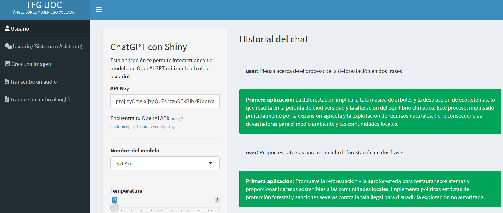
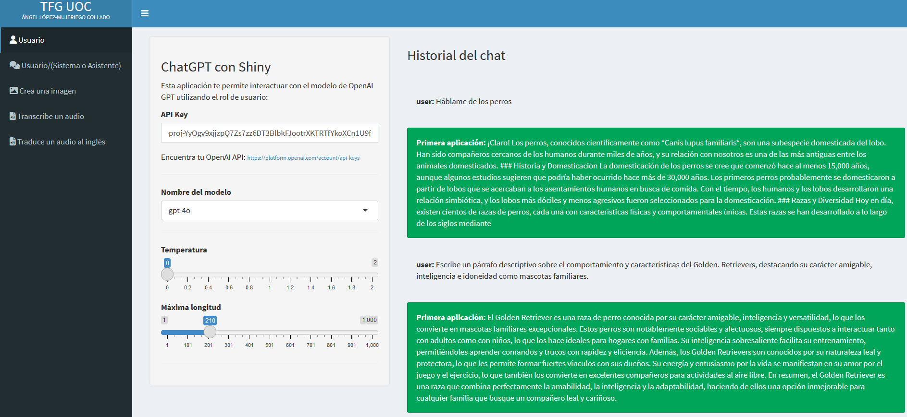
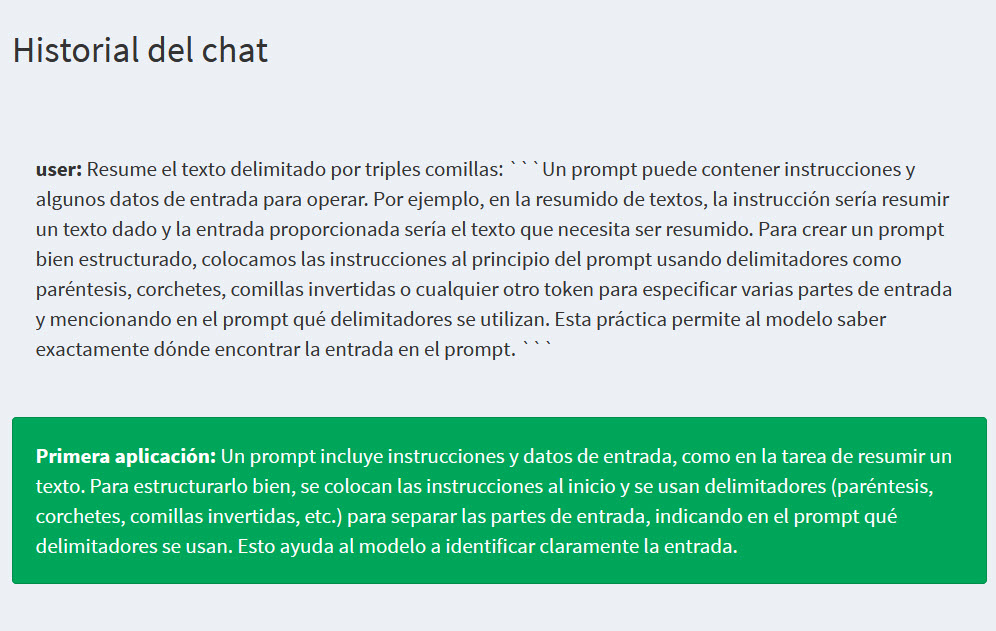

# Principios de la Ingeniería de Prompts

## Claridad y Precisión en los Prompts

Ahora profundizaremos en los principios clave de la ingeniería de prompts para crear prompts más efectivos. Al interactuar con un LLM, apuntamos a prompts claros y precisos para lograr los mejores resultados. Podemos pensar en este proceso como guiar a alguien de un lugar a otro, donde buscamos seleccionar el camino más simple y efectivo entre varias opciones disponibles. Exploraremos 4 principios de la ingeniería de prompts, incluyendo el uso de verbos de acción apropiados, instrucciones, descripciones precisas y prompts delimitados bien estructurados.

## Uso de Verbos de Acción Apropiados

Al pedirle al modelo que realice ciertas tareas, opta por verbos de acción que guíen explícitamente la tarea del modelo, como escribir, completar, explicar, describir o evaluar. Por el contrario, evita usar verbos ambiguos como entender, pensar, sentir, intentar y saber, que podrían confundir la comprensión del modelo. Un prompt que le pida al modelo que piense sobre el problema de la deforestación es ineficaz. Aunque el modelo genere alguna salida sobre la deforestación, el prompt requiere una mayor claridad respecto a las expectativas. Para mejorar el prompt, usamos un verbo de acción que explícitamente le diga al modelo qué hacer. Por ejemplo, le pedimos al modelo que proponga estrategias para reducir la deforestación y, en consecuencia, el modelo ofrece algunas soluciones. En la Figura \@ref(fig:CURSO-18) se observa claramente como mejora la respuesta utilizando verbos apropiados.

(\#fig:CURSO-18)Mejorando las respuestas utilizando verbos apropiados.

## Instrucciones Específicas y Detalladas

Al elaborar prompts, querremos proporcionar instrucciones específicas, descriptivas y detalladas sobre el contexto, la longitud de la salida, el formato, el estilo y la audiencia. Por ejemplo, consideramos un prompt que pide al modelo de lenguaje que nos hable sobre los perros como ineficaz porque es demasiado amplio. Sin embargo, decirle al modelo que describa el comportamiento y las características de una raza de perro específica, como los golden retrievers, permite al modelo ser más preciso con su respuesta (Figura \@ref(fig:CURSO-19)).

(\#fig:CURSO-19)Mejorando las respuestas utilizando descripciones más precisas.

## Descripciones Precisas

Al elaborar prompts, trata de evitar descripciones imprecisas. Por ejemplo, pedir al modelo que genere un texto corto sobre la ingeniería de prompts es ineficaz ya que no especifica cuántos párrafos, oraciones o palabras queremos generar. Para hacer el prompt más efectivo, especificamos explícitamente una longitud de salida esperada, como dos oraciones, y vemos esto reflejado en la salida. Para limitar la longitud de la salida, podemos usar el parámetro Max tokens, que limita el número de tokens y no puede ser superado, lo que lleva a respuestas incompletas o cortadas a veces. Por el contrario, los límites de salida especificados a través del prompt con el número máximo de palabras, oraciones o párrafos podrían ser superados, pero esto garantiza respuestas completas.

## Estructuración de Prompts

Un prompt puede contener instrucciones y algunos datos de entrada para operar. Por ejemplo, en la resumido de textos, la instrucción sería resumir un texto dado y la entrada proporcionada sería el texto que necesita ser resumido. Para crear un prompt bien estructurado, colocamos las instrucciones al principio del prompt usando delimitadores como paréntesis, corchetes, comillas invertidas o cualquier otro token para especificar varias partes de entrada y mencionando en el prompt qué delimitadores se utilizan. Esta práctica permite al modelo saber exactamente dónde encontrar la entrada en el prompt.  Aquí hay un ejemplo de un prompt de resumido de textos donde delimitamos el texto de entrada con comillas triples invertidas. El resultado se observa en la Figura \@ref(fig:CURSO-20).

(\#fig:CURSO-20)Especificando en el prompt que el texto a resumir está delimitado.

<h3 style="font-weight: bold; text-align: center;">Video Tutorial: Principios de la Ingeniería de Prompts</h3>
  <iframe width="500" height="400" src="https://www.youtube-nocookie.com/embed/98b8AEWqIBU?rel=0" frameborder="0" allow="accelerometer; autoplay; encrypted-media; gyroscope; picture-in-picture" allowfullscreen></iframe>

