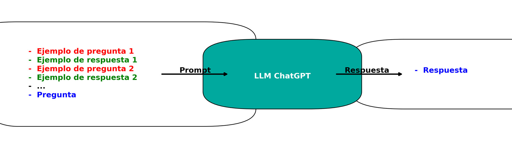
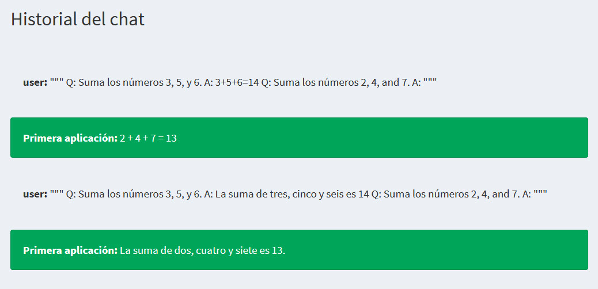

# Técnicas de Prompting Avanzadas

## Prompting de Pocos Disparos

Exploremos el prompting de pocos disparos y sus diferentes aplicaciones. El prompting de fusión es una técnica en la que se presentan ejemplos a los modelos de lenguaje para que aprendan dentro del prompt. Para hacer esto, formulamos un prompt que contiene pares de pregunta y respuesta de ejemplo y la pregunta a la que queremos que el modelo responda. Alimentamos este prompt al modelo y obtenemos la respuesta a nuestra pregunta a cambio. Con este enfoque, el modelo aprende cómo responder la pregunta dada a partir de los ejemplos (\@ref(fig:CURSO-30)). El nombre de la técnica varía dependiendo del número de ejemplos que proporcionamos. Cuando no hay ejemplos proporcionados, estamos utilizando el prompting de cero disparos. Con un ejemplo, estamos utilizando el prompting de un disparo y con más de un ejemplo estamos utilizando el prompting de pocos disparos. Exploremos cada uno de ellos en más detalle.

(\#fig:CURSO-30)Ejemplo de prompting con varios disparos. (Hecho con Python)

## Prompting de Cero Disparos

En el prompting de cero disparos, proporcionamos un prompt al modelo sin ejemplos explícitos. Se espera que el modelo genere una respuesta basada en su conocimiento existente. Esta técnica es ideal para tareas rápidas y sencillas. Por ejemplo, usamos el prompting de cero disparos cuando pedimos al modelo que defina la ingeniería de prompts sin proporcionar ejemplos para guiar la salida tal y como se muestra en la Figura \@ref(fig:CURSO-31).

(\#fig:CURSO-31)Ejemplo de prompting con cero disparos.

## Prompting de Un Disparo

En el prompting de un disparo, proporcionamos un único ejemplo de pregunta y respuesta al modelo, lo que le permite aprender de esa única entrada. Esta técnica es ideal cuando queremos que la salida del modelo siga un formato o estilo específico y consistente. Por ejemplo, supongamos que queremos que el modelo sume 3 números como 3, 5 y 6, con la salida escrita como una ecuación como 3 + 5 + 6 = 14. Usamos este estilo en el ejemplo proporcionado y la respuesta para cualquier nuevo número seguirá el mismo estilo. Para aclarar esta idea, usemos el mismo prompt y ejemplo, pero con la salida siendo una oración como “la suma de tres, cinco y seis es 14”. La respuesta a nuestra segunda pregunta ha seguido el mismo formato como se ve en la Figura \@ref(fig:CURSO-32).

(\#fig:CURSO-32)Ejemplo de prompting con un disparo.

## Prompting de Varios Disparos

Finalmente, en el prompting de varios disparos, proporcionamos más de un ejemplo al modelo. Esta técnica es poderosa cuando queremos que el modelo realice tareas contextuales que requieren más información que el prompting de un disparo puede proporcionar. Por ejemplo, para realizar un análisis de sentimientos, podemos dar al modelo textos de muestra sobre si los comentarios de los productos son positivos o negativos junto con su clasificación y luego pedirle que clasifique un nuevo texto según lo que aprendió (Figura \@ref(fig:CURSO-33)). 

(\#fig:CURSO-33)Ejemplo de prompting varios disparos.

## Consideraciones al Usar Prompting de Varios Disparos

Algunas consideraciones al tratar con el prompting de varios disparos. Debemos considerar la complejidad de la tarea para seleccionar el número óptimo de disparos para proporcionar al modelo. Menos disparos podrían lograr tareas básicas. Por ejemplo, un solo ejemplo podría ser suficiente para controlar la estructura de la salida. Para tareas más complejas como la clasificación de texto en múltiples categorías, es importante incorporar ejemplos diversos asegurando al menos un ejemplo para cada clase para guiar eficazmente la salida del modelo.

<h3 style="font-weight: bold; text-align: center;">Video Tutorial: Técnicas de prompting avanzadas</h3>
  <iframe width="500" height="400" src="https://www.youtube-nocookie.com/embed/34e0JxmS1Jk?rel=0" frameborder="0" allow="accelerometer; autoplay; encrypted-media; gyroscope; picture-in-picture" allowfullscreen></iframe>

